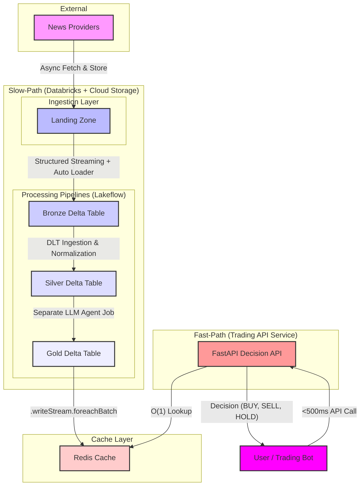

# System Design

This document outlines the system design for a trading decision platform that leverages Large Language Models (LLMs) for market analysis while adhering to a strict sub-500ms (p95) decision latency requirement.

## 1. Latency Optimization Strategy

The core challenge of this system is to reconcile slow LLM inference times (2-5s) with a strict sub-500ms decision latency requirement.

A synchronous, real-time approach is impossible. Our strategy is built on an Asynchronous Pre-computation Architecture, which explicitly decouples the data processing **Slow-Path** from the decision-making **Fast-Path**.

We leverage Databricks for the heavy, scalable processing and Redis as the low-latency cache, ensuring each component is used for its core strength.

### Fast-Path vs. Slow-Path

- **Slow-Path (Asynchronous Pre-computation Workflow).** This path is responsible for all heavy lifting: ingesting raw news, calling the LLM agents, aggregating their outputs, and writing the enriched data to a low-latency cache. It is optimized for throughput and resilience, not immediate response time. This path is continuously running, processing new data as it arrives.

- **Fast-Path (Decision API).** This path is a highly optimized, asynchronous FastAPI service. Its sole responsibility is to receive a request, perform a single, rapid lookup in the pre-populated Redis cache, apply minimal final logic, and return a trading decision. This path is engineered purely to meet the strict **p95 sub-500ms** latency requirement.

#### The Asynchronous Pre-computation Workflow

We are going to perform the next steps to adhere to the Medallion Architecture:

- **Ingestion into Landing Zone.** News data (RSS feed, JSON API, webpages) is ingested into a "Landing Zone" in cloud (it could be a specific folder in S3, ADLS, etc). This is a temporary storage area where raw data is placed immediately after being fetched from the source. Fetch and Store operations must be performed asynchronously.

- **Populate the Bronze Layer.** A Databricks pipeline (specifically, the Structured Streaming with Auto Loader part) reads from this Landing Zone and writes the data to a durable, versioned Delta table. This is where the raw data is given a proper table format with metadata like `ingestion_timestamp`. This **Bronze Delta Table** is a queryable and versioned table of raw data, not just a folder of files.

- **Normalization into a Silver Layer.** A Databricks *Lakeflow Declarative Pipeline* applies normalization, writing the clean data to a **Silver Delta table**. The s here are intended to prepare the data for the LLM calls. This part of the pipeline is highly efficient, processing new data in a near-real-time fashion. keeping latency low.

- **LLM Agent Orchestration and enrichment into a Gold Layer**. LLM Agent Orchestration is achieved by means of a separate, continuous Databricks job that reads from the **Silver Delta table**. This pipeline performs the following steps for each new article:

    - **Parallel LLM Calls**. For each article, the three LLM agents (News Sentiment, Market Context, Risk Assessment) are called in parallel using a distributed map operation (e.g., within a Spark job). This design decouples the pipeline steps and prevents a single failed LLM call from blocking the entire batch.

    - **Aggregation and Enrichment**. The outputs from the three agents are aggregated and combined with the original news data. The final output includes the `signal` (buy/sell/no-trade), `conviction`, and `causality`, as well as a normalized asset ticker (BTC in this case). This enriched data is written to a **Gold Delta table**.

> Another approach here would be to use a monolithic Pandas UDF to call the three LLM agents in parallel for each article. While this is a common pattern, Pandas UDFs have performance implications, especially when making external API calls, so this design would not be the most efficient way to leverage the distributed nature of Spark. Instead of that strategy, this approach separates the "ingestion and normalization" pipeline from the "LLM inference" pipeline, making each more resilient.

- **Cache Warming**. A continuous `writeStream` operation on the **Gold Delta table** uses a `.foreachBatch` function to write the aggregated, pre-computed insights directly into a **Redis cache**. To ensure atomicity and performance, the batch is written in a parallelized, efficient manner. The cache is the central point of truth for the **Fast-Path**.

##### Caching Strategy: Keying and Feature Design

The **Redis cache** is the centerpiece of this strategy. Its design is critical for achieving the required speed.

- **Cache Keying.** The data will be keyed using a composite key: `{asset_ticker}:{event_timestamp}`. This is a crucial improvement for scalability. For example, `BTC:1725595980`. This allows the **Decision API** to fetch all relevant, pre-computed data for a specific asset and timestamp in a single, near-instantaneous O(1) lookup. To facilitate rapid retrieval of the most recent data, a separate key per asset (e.g., `latest_event:BTC`) will store the `event_timestamp` of the latest pre-computed insight, allowing for a two-step, but still sub-millisecond, lookup.

- **Pre-computed Features**. For each news article, we pre-compute and cache a rich set of features, moving beyond just a simple `signal`. This includes:

    - `signal`: The final trading recommendation (1, 0, -1).
    - `conviction`: The LLM's confidence in its recommendation.
    - `causality`: The LLM's reasoning for the signal.
    - `sentiment_score`: Detailed sentiment from the News Sentiment Agent.
    - `key_market_drivers`: Insights from the Market Context Agent.
    - `risk_score`: The risk/reward assessment.
    - `event_timestamp`: The time of the news event.

### Trade-offs: Accuracy vs. Speed

- **Freshness**: The primary trade-off is that our decisions are based on insights that are a few seconds old (the time it takes the **Slow-Path** to complete). This "near-real-time" latency is an acceptable and necessary compromise to enable the use of powerful, but slow, LLMs. The system prioritizes a fast, informed decision over a perfectly real-time one.

- **Fallback Accuracy**: In cases of LLM failure or cache misses, the system must have a robust fallback mechanism. This prioritizes system availability and speed over optimal accuracy. The "minimal final logic" in the Fast-Path includes:

    - **Cache Hit**: If data is found and is considered "fresh" (e.g., within a 5-minute TTL), the signal and conviction are returned.
    - **Cache Miss/Stale Data**: If the cache lookup fails or the data is older than the TTL, the API immediately returns a safe, pre-defined signal of 0 ("No Trade"). It can optionally fall back to a simple, pre-trained, low-latency model (e.g., a simple logistic regression on historical event_df data) to provide a slightly more informed fallback, but the core is to never block for a slow operation.

### Failure Modes & Graceful Degradation

- **Slow-Path Failures**: The Databricks pipeline is designed to be resilient. If an LLM API call fails, the pipeline logs the error and proceeds, writing a `signal` of 0 and a `conviction` of `null` to the cache for that specific article. This prevents a single external service failure from halting the entire pipeline.

- **Redis Failure**: The **Fast-Path** is configured with a circuit breaker for Redis. If a lookup exceeds a sub-millisecond timeout or the cache is down, the circuit breaker opens. The API immediately defaults to the "No Trade" `signal`, ensuring the service remains responsive even when its core dependency is unavailable.

## 2. **Architecture Diagram + Data Flow**

### Data Flow and Latency Budget

This section breaks down the end-to-end data flow, identifying latency budgets for each step and highlighting potential bottlenecks and their mitigation strategies. The total latency for a decision is not the sum of all steps, but rather a parallel process where the "Fast-Path" operates on pre-computed data.

<table>
    <thead>
        <tr>
            <th> Step </th>
            <th> Description </th>
            <th> Latency Budget </th>
            <th> Bottlenecks </th>
            <th> Mitigation </th>
        </tr>
    </thead>
    <tbody>
        <tr>
            <th colspan="5" style="text-align: center">Slow-Path: Ingestion </th>
        </tr>
        <tr>
            <td> 1. Data Source → Landing Zone </td>
            <td> News article becomes available from source and is written to cloud storage (e.g., S3). </td>
            <td> < 500 ms (Best Effort) </td>
            <td> API rate limits and network latency. </td>
            <td> <b>Leverage async power.</b> Use a pool of async Python workers to fetch data. Implement retries with exponential backoff. </td>
        </tr>
        <tr>
            <td> 2. Landing Zone → Bronze Delta Table </td>
            <td> Auto Loader detects a new file and ingests it into the Bronze layer. </td>
            <td> < 1 sec </td>
            <td> File smallness (billions of tiny files). </td>
            <td> <b>Leverage Auto Loader power.</b> Auto Loader handles this efficiently by incrementally listing new files. Databricks' Photon engine and optimized file listing further reduce overhead. </td>
        </tr>
        <tr>
            <td> 3. Bronze → Silver Delta table </td>
            <td> DLT pipeline performs normalization and schema enforcement. </td>
            <td> < 1 sec (Incremental) </td>
            <td> Possible complex transformations and schema drift. </td>
            <td> <b>Leverage DLT power.</b> DLT simplifies this by managing pipeline dependencies and providing expectations for data quality checks. </td>
        </tr>
        <tr>
            <th colspan="5" style="text-align: center">Slow-Path: LLM Enrichment </th>
        </tr>
        <tr>
            <td> 4. Silver → Gold Delta table </td>
            <td> A separate Spark job reads new articles from the <b>Silver Delta table</b>, makes parallel LLM calls, and writes enriched data to the <b>Gold Delta table</b>. </td>
            <td> ~ 2-5 sec (LLM Latency) </td>
            <td> The LLM APIs themselves. Sequential calls would be additive (15+ sec). </td>
            <td> <b>Look for Parallelism.</b> Call the three agents (News Sentiment, Market Context, Risk Assessment) simultaneously for each article using a distributed map operation. This caps the latency at the slowest LLM call time plus network overhead. </td>
        </tr>
        <tr>
            <td> 5. Gold → Redis Cache </td>
            <td> The enriched data is written to Redis via `foreachBatch`. </td>
            <td> < 100 ms </td>
            <td> Possible network overhead, write concurrency. </td>
            <td> <b>Look for Micro-batching.</b> `foreachBatch` writes in small, efficient batches. Ensure Redis is scaled horizontally and that the write operation is non-blocking. </td>
        </tr>
        <tr>
            <th colspan="5" style="text-align: center">Fast-Path: Decision API </th>
        </tr>
        <tr>
            <td> 6. API Request → Redis Lookup </td>
            <td> The FastAPI service receives a POST /decide request and performs a lookup in Redis for the most recent pre-computed signal for the asset (BTC). </td>
            <td> < 10 ms </td>
            <td> Possible network latency to Redis and slow Redis instance. </td>
            <td> <b>Look for Caching.</b> Redis is purpose-built for low-latency lookups. The composite key ensures a single, efficient O(1) operation. Place Redis instance in the same region as the API service. </td>
        </tr>
        <tr>
            <td> 7. Final Logic and Response </td>
            <td> The API applies minimal logic (e.g., checks for cache freshness, falls back if stale) and returns the decision. </td>
            <td> < 50 ms </td>
            <td> Possible overly complex logic in the <b>Fast-Path</b>. </td>
            <td> <b>KISS principle.</b> The <b>Fast-Path</b> is intentionally dumb. All complex logic (LLM inference) is done ahead of time in the <b>Slow-Path</b>. This step should only perform a basic check and prepare the response. </td>
        </tr>
    </tbody>
</table>

#### Summary of Bottlenecks and Mitigation

- **LLM Latency (The Main Bottleneck).** The core challenge is directly addressed by the Asynchronous Pre-computation Architecture. We don't wait for LLM inference; we use its output after the fact. The parallel execution of LLM API calls is the key to keeping the total pre-computation latency for a single article within the 2-5 second range, preventing a 15-second sequential delay.

- **Data Ingestion Volume.** Handling 100+ articles/minute requires a scalable ingestion solution. Databricks Auto Loader with Structured Streaming is designed for this, automatically scaling to handle millions of files and providing a fault-tolerant, incremental processing model.

- **Cache Write Performance.** Writing large volumes of data from the Gold table to Redis could be a bottleneck. The foreachBatch with a parallelized Redis connector ensures that Spark's distributed processing power is fully utilized to write data to the cache efficiently, preventing a backlog.

- **Decision API Latency.** The FastAPI service is designed for a single purpose: fast retrieval. Its latency is dominated by the network round trip to Redis. Placing the Redis cluster in the same cloud region as the API service is a critical operational decision to ensure sub-10ms lookups. The fallback mechanism for cache misses is the final layer of defense, guaranteeing a fast response even in a degraded state.

## 3. Multi-Agent Orchestration

The core of this system's **Slow-Path** is the efficient orchestration of the three LLM agents. The key is to avoid sequential calls, which would result in an unacceptable 15-second latency (3 agents * 5s/agent). The strategy is built on parallel execution, distributed processing, and a robust aggregation and consensus mechanism.

### Collaboration and Parallelism

The three agents operate in a parallel and asynchronous manner. The Databricks environment is an ideal platform for this due to its distributed nature. The orchestration is handled in the pipeline that transforms the **Silver Delta table** to the **Gold Delta table**.

- **Triggering.** The pipeline reads new, normalized articles from the **Silver Delta table**. Each new row in this table triggers the orchestration process for a new piece of news.

- **Distributed Fan-Out.** For each micro-batch of new articles, a Spark job is triggered. This job distributes the articles across the worker nodes in the Databricks cluster.

- **Parallel API Calls.** On each worker node, for every article, the following actions are executed concurrently:

    - **Call 1: News Sentiment Agent.** An asynchronous HTTP request is sent to the News Sentiment LLM API, passing the raw news text.

    - **Call 2: Market Context Agent.** Simultaneously, an asynchronous HTTP request is sent to the Market Context LLM API, passing the news text and relevant market data (pre-fetched from a separate data source, e.g., the market_df or a real-time market data feed).

    - **Call 3: Risk Assessment Agent.** Concurrently, a third asynchronous HTTP request is sent to the Risk Assessment LLM API.

This parallel execution ensures that the total time for LLM inference for a single article is capped by the latency of the slowest agent call, plus network overhead, which is roughly ~2-5 seconds.

### Aggregation and Consensus Logic

The outputs from the three agents are then collected on the Spark driver or a designated worker node for aggregation. This is where the outputs are transformed into the final `signal` and `conviction`.

- **Input Data.** The input for this step is a JSON object or structured data containing the outputs from each agent, which include a `score` (sentiment, context, risk) and a `confidence` score.

- **Consensus signal Calculation.** The final `signal` (buy, no-trade, sell) is not a simple average but a weighted decision based on a pre-trained *Logistic Regression* model. This model provides a more sophisticated consensus than simple rules.

    - The model's inputs are the normalized scores from each agent: sentiment, context, and risk.

    - The signal is determined by the output of the logistic regression function:

        $$
        signal=Round\left( LogisticRegression \left( \sum_{i=1}^{i=3} w_{i} * score_{i} \right)\right)
        $$

        where indexes 1, 2, 3 refer to news sentiment, market context, risk assessment correspondingly. The weights $w_{i}$ are determined from historical training data and can be adjusted over time to reflect the relative importance of each agent's input. For example, the Market Context Agent might be weighted more heavily than the others during periods of high market volatility.
    
    - **`conviction` Calculation.** The `conviction` is a measure of the system's certainty in its own decision. A simple aggregation of confidence scores is a good starting point. However, a more robust approach would be to use a weighted average. Each agent's confidence score is multiplied by a weight, and the results are summed.

        - **Confidence Scores.** Assume each agent returns a confidence score (e.g., from 0.0 to 1.0).

        - Final conviction is calculated as a weighted average:

            $$
            conviction = \frac{ \sum_{i=1}^{i=3} c_{i} * ConficendeScore }{ \sum_{i=1}^{i=3} c_{i} }
            $$

            The weights $c_{i}$ for this calculation can be based on the historical accuracy of each agent. If the News Sentiment Agent has historically been very reliable, its confidence score could be weighted more heavily in the final conviction score.

### Avoiding Sequential 15-second Latency

The system is architected to eliminate the 15-second sequential latency from the ground up, leveraging the core strengths of Databricks' distributed platform and the asynchronous, event-driven nature of our pipeline.

- **Distributed Parallelism**. The core strategy relies on the inherent distributed nature of Databricks' compute engine. The pipeline that transforms the **Silver Delta table** to the **Gold Delta table** operates on a continuous stream. When a new micro-batch of articles arrives, each article is a new row in the stream. Spark, in a distributed manner, can process each of these rows as a separate task, or as a group of tasks, across its worker nodes. Each worker node is then responsible for making the API calls for a subset of the articles in the batch. The key is that the three LLM agent calls for a single article are executed in parallel on a worker node, not sequentially. This ensures that the total processing time for an article is gated by the longest LLM call (~2-5 seconds), not the sum of them.

- **Continuous, Asynchronous Processing.** The pipeline is designed as a continuous, streaming job using Lakeflow Declarative Pipelines.

    - **Unblocking by Design.** A new article arriving in the **Silver Delta table** does not need to wait for a previous article's LLM calls to complete. The DLT job processes new data as it becomes available. If a batch of LLM calls for a prior article is taking longer than expected, the system will not be blocked. It will simply start processing the next available micro-batch of new articles, creating new distributed tasks. This asynchronous and non-blocking behavior is a fundamental aspect of structured streaming.

    - **Error Handling**. If a specific LLM call fails or times out for an article, that task will fail. Lakeflow will automatically re-process that record. If the issue persists, the pipeline can be configured to either retry or, more preferably in a trading system, to drop the record or store it with a `signal` of 0 ("no-trade") and a clear error log, allowing the stream to continue unhindered.

- **Decoupled Pipelines.** As previously established, the LLM orchestration is a separate, dedicated job. It runs continuously, processing new articles as they appear in the Silver Delta table. This is a critical architectural choice that prevents a slowdown in the LLM process from affecting the initial ingestion and normalization pipeline. The **Slow-Path** is modular, allowing us to scale the ingestion and LLM processing clusters independently, ensuring the overall system remains performant and fault-tolerant.

## 4. Technology Stack Justification

The technology stack is chosen with one primary goal in mind: *to meet the sub-500ms decision latency despite slow LLM inference*. Each component is selected to maximize performance, scalability, and resilience.

<table>
    <thead>
        <tr>
            <th> Component </th>
            <th> Choice </th>
            <th> Justification </th>
            <th> Alternatives </th>
        </tr>
    </thead>
    <tbody>
        <tr>
            <td> Cache Layer </td>
            <td> <b>Redis</b> is the optimal choice for the low-latency cache layer. </td>
            <td>
                <ul>
                    <li> <b>Sub-Millisecond Latency.</b> Redis is an in-memory data store, purpose-built for high-speed read/write operations. A simple `GET` or `HGET` operation on a pre-computed key can be completed in less than a millisecond, which is well within our strict latency budget for the <b>Fast-Path</b>. </li>
                    <li> <b>Versatile Data Structures.</b> Redis supports various data structures beyond simple key-value pairs, such as Hashes, which are ideal for storing the rich, pre-computed features for each news article (e.g., `signal`, `conviction`, `sentiment_score`, `risk_score`) under a single, composite key. This allows the <b>Decision API</b> to fetch all relevant data in a single, atomic lookup. </li>
                    <li> <b>Scalability.</b> Redis can be deployed in a clustered configuration to scale horizontally, handling the high volume of writes from the Databricks <b>Slow-Path</b> and the concurrent read requests from the FastAPI Decision API without becoming a bottleneck. </li>
                </ul>
            </td>
            <td>
                <ul>
                    <li> <b>Vector DB (e.g., Pinecone, Milvus).</b> While excellent for semantic search, they are not designed for direct key-value lookups of structured data. Their primary purpose is similarity search, which is a different use case and would add unnecessary complexity and latency for a simple data retrieval. </li>
                    <li> <b>Relational DB (e.g., PostgreSQL).</b> Too slow for sub-500ms lookups. Disk I/O and query overhead make them unsuitable for this low-latency caching role. </li>
                </ul>
            </td>
        </tr>
        <tr>
            <td> Streaming/Queue Component </td>
            <td> <b>Streaming on Databricks.</b> Leveraging Databricks' Structured Streaming with Lakeflow Declarative Pipelines is the preferred approach over managing a separate message queue like Kafka. </td>
            <td>
                <ul>
                    <li> <b>Unified Platform.</b> Databricks provides a single, unified platform for ingestion, transformation, and LLM orchestration. Using Structured Streaming and Lakeflow eliminates the need to manage a separate Kafka cluster, reducing operational overhead, infrastructure costs, and the complexity of integrating different systems. </li>
                    <li> <b>Simplicity and Resilience.</b> Lakeflow simplifies the creation of streaming pipelines. It automatically handles state management, fault tolerance, and job orchestration. Instead of manually writing consumer/producer logic for a Kafka queue, you simply define a declarative pipeline. The Auto Loader feature provides an elegant solution for continuous ingestion from cloud storage without manual file tracking. </li>
                    <li> <b>Latency-Aware Micro-batching.</b> Structured Streaming processes data in small micro-batches, providing near-real-time latency without the complexity of a true real-time stream processing engine. The .foreachBatch function allows us to perform the Redis write operation efficiently and in a controlled manner. </li>
                    <li> <b>Scalability.</b> Databricks automatically scales the compute resources of the streaming job based on the data volume, ensuring the pipeline can handle bursts of news articles during market hours without manual intervention. </li>
                </ul>
            </td>
            <td>
                <ul>
                    <li> <b>Kafka.</b> While a valid choice, it would introduce a new technology to the stack that would need to be provisioned, configured, and managed. The overhead of running a Kafka cluster and writing a separate Spark Streaming application to consume from it is high compared to the native, integrated solution offered by Databricks. </li>
                </ul>
            </td>
        </tr>
        <tr>
            <td> Model Hosting & Versioning </td>
            <td> <b>Databricks + MLflow.</b> Databricks' built-in Model Serving and MLflow capabilities are the ideal solution for hosting and versioning models. </td>
            <td>
                <ul>
                    <li> <b>Integrated Platform.</b> Databricks' MLflow provides a complete lifecycle management solution for machine learning models. It allows us to track experiments, log model parameters and metrics, and register and version models in a centralized Model Registry. This is invaluable for managing the evolution of our consensus model. </li>
                    <li> <b>Model Serving for Low Latency.</b> Once a model (like our Logistic Regression for signal calculation) is in the Model Registry, Databricks can host it as a low-latency, real-time REST API endpoint. This means we don't have to build a separate Flask or FastAPI service for the consensus model itself; it's a managed, scalable endpoint. </li>
                    <li> <b>Versioning and Stage Management.</b> MLflow's Model Registry allows for versioning (e.g., v1, v2) and stage management (Staging, Production). This is crucial for A/B testing new versions of our logistic regression model or any custom LLM we develop. </li>
                    <li> <b>Possibility to create our own LLM models.</b> Databricks is a leading platform for training and fine-tuning LLMs on custom data. We can leverage the same platform to fine-tune open-source models (like LLaMA or Falcon) on our specific news domain and event_df data. Once fine-tuned, these models can be registered with MLflow and deployed using Databricks Model Serving. This provides a single, consistent workflow for all our models—from the simple consensus model to a complex, custom LLM for sentiment analysis—and avoids the need for external model hosting platforms. This is a key advantage, as it allows us to retain full control and intellectual property over our models, improving accuracy and reducing reliance on third-party APIs over time. </li>
                </ul>
            </td>
        </tr>
    </tbody>
</table>

## 5. Pre-computation and Cache Warming

The pre-computation and cache-warming strategy is the backbone of our low-latency design. It ensures the Fast-Path is always ready with the data it needs, effectively hiding the long latency of LLM calls from the end-user.

### What is Pre-computed Ahead of Time?

Our system pre-computes two main components in the Slow-Path, which are then stored in Redis for fast retrieval by the Fast-Path:

1. **Enriched News Data and Final Decision.** This is the primary output of the multi-agent orchestration. For each news article, we pre-compute the following:

    - The final `signal` (Buy, Sell, No Trade) from the Logistic Regression consensus model.
    - The `conviction` score, calculated as the weighted aggregation of confidence scores from each LLM agent.
    - The `causality` or reasoning from the LLM agents.
    - Raw scores from each agent (`sentiment_score`, `market_context_score`, `risk_score`).

This rich, pre-computed JSON object is what the Decision API retrieves in a single, fast lookup.

2. **Model Weights and Parameters.** The weights $w_{i}$ for the Logistic Regression model for the final `signal` and the weights $c_{i}$ for the `conviction` are not static. We pre-compute and update them periodically. This is a crucial, though less frequent, form of pre-computation. The process involves:

    - **Training.** A scheduled Databricks job runs a notebook that uses historical data (the **Gold Delta table** with actual trading outcomes) to retrain the Logistic Regression model.
    - **Validation.** The new model is tested against a holdout dataset to ensure it's more reliable than the current production model.
    - **Versioning.** Using MLflow, the new model is registered in the **Model Registry** with a new version number.
    - **Deployment.** The new model is promoted to the `Production` stage in MLflow. The **Databricks Model Serving** endpoint automatically updates to use the new version, ensuring the consensus logic is always based on the most up-to-date and battle-tested weights. This whole process happens in the background and is completely decoupled from the real-time decision-making.

### Cache Warming for Cold-Start Mitigation

"Cold-start" is the state where the cache is empty, and the first request for a specific asset would result in a cache miss, leading to a "No Trade" fallback signal. Our strategy mitigates this proactively.

- **Continuous Warming.** The system is designed to be continuously warm. The `writeStream` operation from the **Gold Delta table** to the Redis cache runs 24/7. As soon as a new article is processed and enriched by the LLM agents (the **Slow-Path**), its insights are immediately written to Redis. There is no manual "warming" job needed for new data arriving during the day.

- **Backfill for Scheduled Events.** While continuous warming handles real-time data, a scheduled Databricks job is still valuable for backfilling in specific scenarios, such as after a system restart or for processing a large historical backlog of news from a period when the system was offline. This scheduled job can process a batch of news from the past few hours and populate the cache to ensure the system is fully primed for the start of a busy trading day.

### Cache Invalidation & Freshness Strategies

The integrity of the system hinges on having fresh data in the cache. Our approach combines an automated event-driven model with a time-based safety net.

- **Event-Driven Invalidation.** This is our primary strategy. The Databricks pipeline is a stream processor. As a new article is processed and the final signal is computed, it is immediately written to Redis with a composite key (e.g., `BTC:1725595980`). If another article related to the same asset arrives a minute later, its insights are written to a new key (e.g., `BTC:1725596040`). The Decision API is designed to always look up the latest pre-computed insight for an asset, effectively making the older entry "stale" without an explicit invalidation command.

- **TTL (Time-To-Live).** As a safety net, each key in Redis has a short TTL (e.g., 5-10 minutes). This ensures that if the continuous pipeline were to fail, stale data would not persist indefinitely.

- **Optional enhancement: Temporal Decay for `conviction`.** We can apply a temporal decay function to the `conviction` score in the **Fast-Path**. The final score returned to the user would be:

$$
conviction_{final} = conviction_{cached} * e^{−\lambda ⋅ \Delta t}
$$

where $\Delta t$ is the time difference in minutes since the news was cached, and $\lambda$ is a decay constant. This means the system's `conviction` in a decision naturally lessens over time, providing a more realistic and risk-aware output. The API would return a `signal` of 0 if the decayed conviction falls below a certain threshold.

### The Fallback Mechanism: Prioritizing Speed and Availability

The fallback is a critical part of our freshness strategy.

- **Fast Failover.** The FastAPI Decision API is designed to prioritize speed. If a Redis lookup takes longer than a micro-second threshold or results in a miss (due to a cold-start, key expiration, or pipeline failure), the API immediately returns a safe signal of 0 ("No Trade").

- **Informed Fallback.** The API can be optionally configured to fall back to a tiny, in-memory, pre-trained model for a slightly more informed decision than a simple "No Trade". This model, likely a simpler logistic regression trained on a recent, concise dataset, would have a negligible latency footprint. It's a "break glass in case of emergency" feature that adds a layer of intelligence without compromising the primary design principle of non-blocking, sub-500ms responses.

## 6. Failure Modes & Graceful Degradation

A robust system is not one that never fails, but one that is designed to fail gracefully. Our architecture, with its clear separation of concerns between the Slow-Path and the Fast-Path, is inherently resilient. This section details the specific failure modes we've identified and the corresponding strategies for graceful degradation.

### 1. When LLM APIs are Slow or Unavailable

This is the most critical failure point and the core problem our architecture solves.

- **Failure Mode:** One or more of the LLM agents (News Sentiment, Market Context, Risk Assessment) becomes unresponsive, returns an error, or times out.

- **Mitigation (Slow-Path):**

    - **Retry with Exponential Backoff:** The Databricks job responsible for LLM orchestration is configured to automatically retry failed API calls. It will use an exponential backoff strategy to avoid overwhelming the LLM service if it's temporarily down or overloaded.

    - **Fault Tolerance:** If a call to a specific LLM agent fails after retries are exhausted, the pipeline is designed not to halt. Instead, the failed record is logged, and a placeholder value (e.g., a score of 0 and a null confidence) is used for that agent's output. The pipeline continues to process the other agents and the next articles in the stream. This prevents a single external service failure from blocking the entire data flow.

    - **Dead Letter Queue:** For records that consistently fail to be processed, they can be routed to a separate "Dead Letter Queue" Delta table for later analysis and manual intervention.

### 2. When the Databricks Pipeline Fails

The **Slow-Path** itself is a point of failure, but its stateful, declarative nature makes it highly resilient.

- **Failure Mode:** The Lakeflow pipeline itself fails (e.g., due to a cluster crash, a code error in a transformation, or a persistent issue with an external API).

- **Mitigation (Slow-Path):**

    - **Automated Retries:** Lakeflow (formerly DLT) has built-in, escalating retries for production pipelines. It will automatically restart the cluster and re-run the failed tasks, picking up exactly where it left off, thanks to its managed state.

    - **Idempotency:** All pipeline operations are designed to be idempotent. This means if a batch of data is reprocessed, it will not create duplicate records or corrupted state, as Delta Lake and the streaming architecture handle this gracefully.

    - **Monitoring and Alerts:** Automated alerts are configured to notify the operations team via email or a messaging service (e.g., PagerDuty) if the pipeline enters a non-recoverable failure state.

### 3. Cache Misses or Stale Data

This failure mode directly impacts the performance of the **Fast-Path**.

- **Failure Mode:** The FastAPI Decision API attempts to look up an insight in the Redis cache, but the key is not found (a "miss") or the data is considered "stale" based on its TTL.

- **Mitigation (Fast-Path):**

    - **Fallback to Rules-Based Logic:** The most important graceful degradation is the immediate return of a "No Trade" signal (0). This is a safe and conservative default that prevents a user from making a trade based on outdated or non-existent information. This fallback is designed to be a hard-coded, sub-millisecond operation.

    - **Informed Fallback (Smaller Models):** As a more sophisticated fallback, the API can have a very simple, in-memory model (like a basic logistic regression with static weights) that can provide a slightly more informed decision than a simple "No Trade". This model would have a near-zero latency footprint and could provide a basic signal if needed. However, the default "No Trade" is the safest bet in a high-stakes, low-latency environment.

    - **Circuit Breakers:** A circuit breaker pattern is implemented for the Redis cache connection. If a predefined number of consecutive requests to Redis fail or time out, the circuit "opens." When the circuit is open, all subsequent requests to Redis are immediately blocked and failed, and the API immediately serves the "No Trade" fallback. This prevents a flood of requests from a failing API from overwhelming the cache or causing cascading failures in the **Fast-Path**. The circuit will periodically enter a "half-open" state to test if the connection to Redis has recovered before fully closing.

### 4. Full System Degradation

- **Failure Mode:** A major event, such as a cloud provider outage, causes both the Databricks and Redis services to become unavailable.

- **Mitigation:**

    - **Availability over Accuracy:** The top priority is to maintain system availability. In this scenario, the FastAPI Decision API is designed to return the "No Trade" signal for all requests. The user or trading bot receives a clear, consistent, and fast response, even if the underlying data and logic are unavailable. The API remains "up" and responsive, preventing a complete system failure from a user perspective.

    - **Informative Error Handling:** Instead of a generic server error, the API's response payload should include a clear status message indicating the degraded state, such as `{"status": "degraded", "message": "Real-time insights are unavailable. Returning safe default."}`. This communicates the issue to the client without exposing internal details.

By implementing these layers of defense, the system gracefully degrades from a fully intelligent, LLM-powered decision maker to a safe, rule-based fall-back system, ensuring that a fast and reliable decision is always available.
